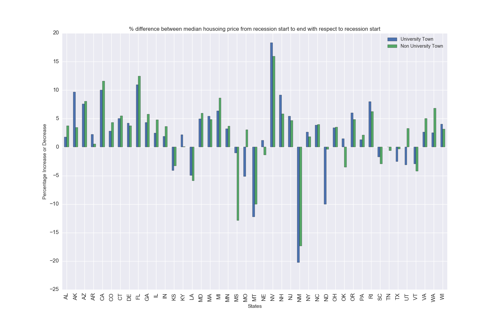
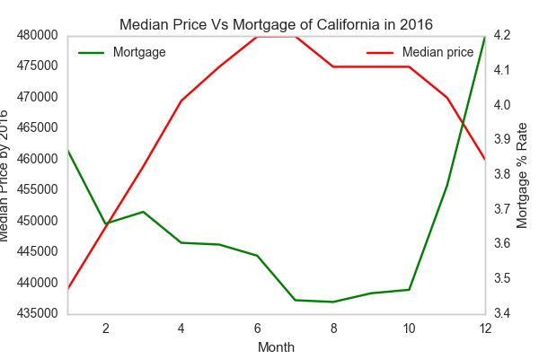
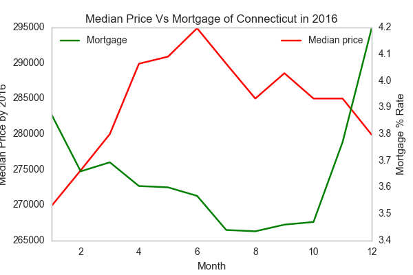
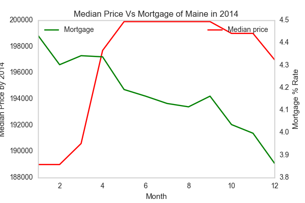
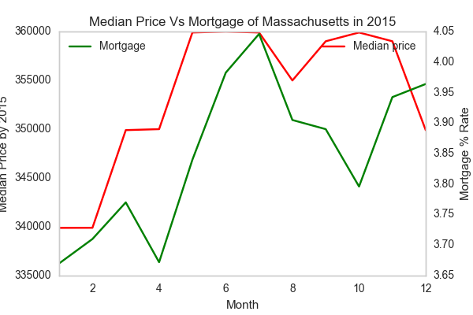
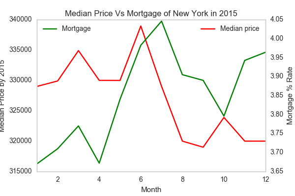

# INFO 7374 Data Analysis Using Python - Final Project
## Zillow Housing Data Analysis


The data used are as follows:
* From Zillow Data the data such as City's MedianPrice ALL Homes, States House MedianPrice etc. from [Zillow DATA](https://www.zillow.com/research/data/) 
* From the Wikipedia page on college towns is a list of [university towns in the United States](https://en.wikipedia.org/wiki/List_of_college_towns#College_towns_in_the_United_States) which has been copy and pasted into the file ```university_towns.txt```.
* From Bureau of Economic Analysis, US Department of Commerce, the [GDP over time](http://www.bea.gov/national/index.htm#gdp) of the United States in current dollars.
* From Federal Reserve Bank of ST. Louis ,the [30 - Year Fixed Rate Mortgage Average in the United States ](https://fred.stlouisfed.org/series/MORTGAGE30US) of the United States in Percentage. 

*Data Formats*

1. Zillow -CSV File
2. College Towns -txt File
3. Bureau of Economic Analysis, US Department of Commerce(GDP) - CSV File
4. Federal Reserve Bank of ST. Louis (30-Yr Mortgage Rate) - CSV File
## Analysis 1

## Does University towns have their mean housing prices less effected by recessions?

Data Used:

1. Zillow:-[City_Zhvi_AllHomes.csv](City_Zhvi_AllHomes.csv)
2. [University towns in the United States](https://en.wikipedia.org/wiki/List_of_college_towns#College_towns_in_the_United_States) [File]()
3. GDP over time:-[gdplev.xls]()

**Steps:**

1. <a href=" ">University file</a> file is reading and need to clean the file of University Town. Separate out State name, Town Name and University Name.
2. For GDP find the Recession Start Quater and Recession End Quater
3. Convert [file](filelink) from number of year to Quaters of Housing Data.
4. Replacing the Abrrievate of States code to State Name of Housing Data.
5. Getting Price of House from Recession Start and Recession End and find the Percentage by(Recession Start- Recession End)/Recession End  whole multiple by 100 of University Town and Non University Town.

## Outputs :
Plot Files:<a href="Output/Analysis1/Analysis1_University_NonUniversity.png"> Analysis 1 Files</a>
## Unviersity town vs Non University town


# Analysis 2

### Is their any Relationship between Mortgage Rates and Housing price?
As per the [blog](http://www.bankrate.com/finance/mortgages/rising-rates-lower-house-prices.aspx) and articles. It's a common belief in real estate that house prices are correlated to interest rates. The idea, beloved by homebuyers, is that if mortgage rates rise, prices of homes for sale must fall because otherwise those homes will become less affordable.
Data Used and Input Parameters:
1. Zillow:-[City_Zhvi_AllHomes.csv](City_Zhvi_AllHomes.csv)
2. From Federal Reserve Bank of ST. Louis ,the [30 - Year Fixed Rate Mortgage Average in the United States ](https://fred.stlouisfed.org/series/MORTGAGE30US)

**Steps:**
1. The CSV of States MedianLisitngprice of All Homes contains $ price from 2010-01 to 2017-02
2. Cleaning data and make the Rows as the Month and Column as state name and Year
3. Mortgage [file](link of mortgage) read as CSV file with 30 Year Fixed Interest.
4. Cleaning and Manipulating Mortgage file.
5. Analyzing the relationship between Mortgage and Housing Price in different year and different states.

## Outputs
Plot Files:<a href="Output/Analysis2"> Analysis2 Files </a>

### Mortgage 30 Year Fix Vs Housing Price






